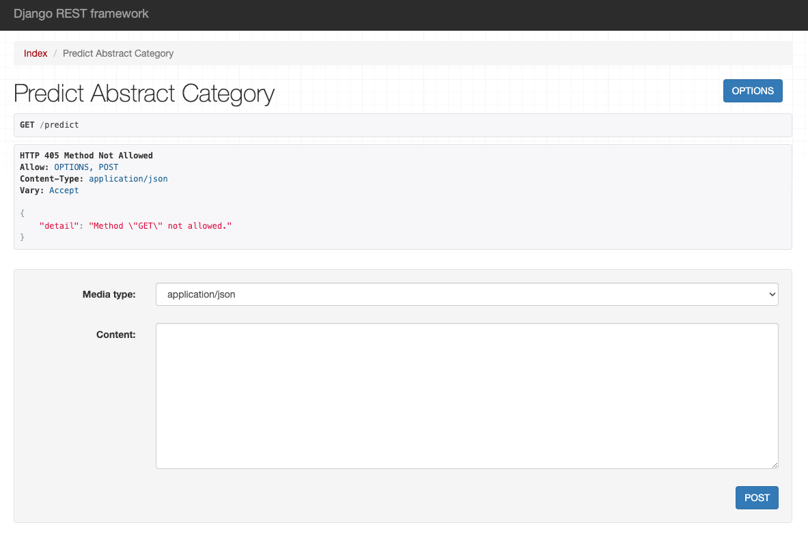
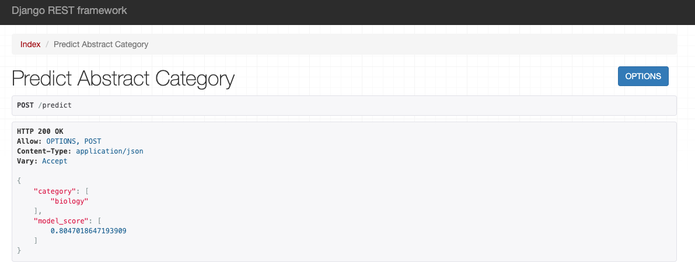
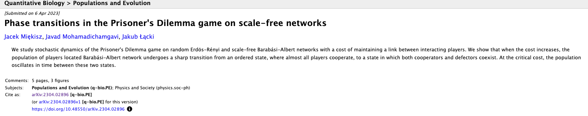

# arxiv-abstract-classifier
Multi-label classification of ArXiv article's abstracts using Hagging Face Bert and Tensorflow

### How to launch and test an application:
1. Clone repository with the `git clone` command.
2. Add Python Interpreter (I used python3.10).
3. Activate venv (for MacOS: `source <venv>/bin/activate` command, for Windows: `<venv>\Scripts\activate.bat`).
4. Install libraries using requirements.txt: `pip install -r /path/to/requirements.txt`.

*Note! If you have MacOS M1 - you need to `pip install tensorflow-macos` in addition to requirements*.

5. Go to arvix_development folder, open terminal in that folder, and start the server using `python manage.py runserver`.
6. Open browser at http://127.0.0.1:8000/predict, you should be able to see the next page:

7. Paste an article abstract in json format, for example:

`{
    "abstract": "We study stochastic dynamics of the Prisoner's Dilemma game on random Erdös-Rényi and scale-free Barabási-Albert networks with a cost of maintaining a link between interacting players. We show that when the cost increases, the population of players located Barabási-Albert network undergoes a sharp transition from an ordered state, where almost all players cooperate, to a state in which both cooperators and defectors coexist. At the critical cost, the population oscillates in time between these two states."
}`

and hit POST.
8. Look at the result of the prediction:

9. Check the article source (biology as well :) ):

### Project structure

- EDA_arXiv.ipynb - notebook for EDA and preprocessing. Model was trained and tuned using Google Colab.
- arvix_api - application that contains trained model loading, views, and tests
- arvix_deployment - contains setting of the project
- arxiv_transformer_model - fine-tuned bert-base-uncased model
- src - custom helper functions

### Configurations
Python 3.10
Hugging face model: https://huggingface.co/bert-base-uncased and its BertTokenizerFast

